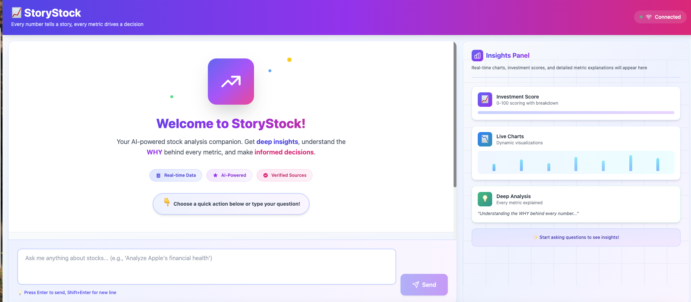

# StoryStock - Interactive Stock Analysis App

**Tagline:** "Every number tells a story, and every metric drives a decision."

An AI-powered conversational stock analysis platform that provides deep insights with full transparency on data sources, calculations, and implications. Unlike traditional finance apps, StoryStock explains the **WHY** behind every metric.

## Features

### Core Capabilities
- **Conversational AI Interface** - Natural language queries powered by Claude API
- **Deep "Why" Explanations** - Every metric comes with detailed explanations, calculations, and context
- **Investment Scoring System** - Comprehensive 0-100 scoring with full breakdown across:
  - Financial Health (30 pts)
  - Valuation (25 pts)
  - Growth (25 pts)
  - Market Sentiment (20 pts)
- **Real-time Data** - Live stock data via Yahoo Finance
- **Multi-turn Conversations** - Context-aware follow-up questions
- **WebSocket Streaming** - Real-time response streaming for instant feedback

### Coming Soon
- **FinGPT Integration** - News sentiment analysis
- **Dynamic Charts** - Auto-generated visualizations based on queries
- **Portfolio Analysis** - Analyze entire portfolios
- **Custom ML Predictions** - LSTM-based price forecasts

## Tech Stack

### Frontend
- React 18 + TypeScript
- Tailwind CSS for styling
- Socket.IO for WebSocket connection
- Vite for development/building
- React Markdown for formatted responses

### Backend
- Node.js + Express + TypeScript
- Socket.IO for real-time communication
- Anthropic Claude API for AI analysis
- Yahoo Finance API for stock data
- Investment scoring algorithm with detailed breakdowns

## Project Structure

```
StoryStock/
├── backend/
│   ├── src/
│   │   ├── services/
│   │   │   ├── yahooFinance.ts     # Yahoo Finance API integration
│   │   │   ├── investmentScore.ts  # Scoring algorithm
│   │   │   └── claude.ts           # Claude API with tool calling
│   │   ├── types/
│   │   │   └── index.ts            # TypeScript types
│   │   └── index.ts                # Express server with Socket.IO
│   ├── package.json
│   ├── tsconfig.json
│   └── Dockerfile
├── frontend/
│   ├── src/
│   │   ├── components/
│   │   │   ├── Chat.tsx            # Main chat component
│   │   │   ├── ChatMessage.tsx     # Message display
│   │   │   ├── ChatInput.tsx       # Input component
│   │   │   └── QuickActions.tsx    # Quick action buttons
│   │   ├── hooks/
│   │   │   └── useSocket.ts        # WebSocket hook
│   │   ├── types/
│   │   │   └── index.ts            # TypeScript types
│   │   ├── styles/
│   │   │   └── index.css           # Tailwind styles
│   │   ├── App.tsx
│   │   └── main.tsx
│   ├── package.json
│   ├── vite.config.ts
│   ├── tsconfig.json
│   └── Dockerfile
├── docker-compose.yml
├── claude.md                       # Project specification
└── README.md
```

## Getting Started

### Prerequisites
- Node.js 20+
- npm or yarn
- Anthropic API key ([get one here](https://console.anthropic.com/))

### Installation

1. **Clone the repository**
```bash
git clone <your-repo>
cd StoryStock
```

2. **Set up backend**
```bash
cd backend
npm install
cp .env.example .env
# Edit .env and add your ANTHROPIC_API_KEY
```

3. **Set up frontend**
```bash
cd ../frontend
npm install
cp .env.example .env
```

### Running Locally

#### Option 1: Manual Start

**Terminal 1 - Backend:**
```bash
cd backend
npm run dev
```

**Terminal 2 - Frontend:**
```bash
cd frontend
npm run dev
```

Access the app at: http://localhost:3000

#### Option 2: Docker Compose

```bash
# Set environment variable
export ANTHROPIC_API_KEY=sk-ant-xxx

# Start all services
docker-compose up
```

Access the app at: http://localhost:3000

### Environment Variables

**Backend (.env):**
```env
PORT=4000
NODE_ENV=development
ANTHROPIC_API_KEY=sk-ant-xxx
CORS_ORIGIN=http://localhost:3000
```

**Frontend (.env):**
```env
VITE_API_URL=http://localhost:4000
VITE_WS_URL=http://localhost:4000
```

## Usage Examples

Try these queries:

1. **Deep Analysis:**
   - "Analyze Apple's financial health"
   - "Give me a comprehensive investment score for Tesla"

2. **Comparisons:**
   - "Compare Apple and Microsoft across key metrics"
   - "Which is better for long-term investment: AAPL or GOOGL?"

3. **Understanding Metrics:**
   - "Why is Tesla's P/E ratio so high?"
   - "Explain Apple's debt-to-equity ratio and what it means"

4. **Quick Insights:**
   - "What's driving Amazon's stock price lately?"
   - "Show me insider trading activity for NVIDIA"

## Key Differentiator: Deep "Why" Explanations

Unlike other finance apps, StoryStock provides:

1. **Calculation Transparency** - Shows exactly how metrics are calculated
2. **Source Attribution** - Cites all data sources explicitly
3. **Historical Context** - Compares to 5-year trends
4. **Peer Comparison** - Shows how metrics compare to competitors
5. **Investment Implications** - Explains what each metric means for decisions
6. **Multiple Perspectives** - Presents bull case, bear case, and neutral view

Example response structure:
```
━━━━━━━━━━━━━━━━━━━━━━━━━━━━━━━━━━━━━━━━━━━━━━━━━━━
📊 INVESTMENT SCORE: 68/100 (HOLD)
━━━━━━━━━━━━━━━━━━━━━━━━━━━━━━━━━━━━━━━━━━━━━━━━━━━

🔍 HOW WE CALCULATED THIS:

┌─ FINANCIAL HEALTH: 24/30 points ─────────────────┐
│                                                   │
│ ✅ Current Ratio: 2.1                            │
│    Why this matters: Company can cover 2x its    │
│    short-term obligations. Healthy liquidity.    │
│    Benchmark: Sector avg is 1.5                  │
│    Source: Yahoo Finance - Balance Sheet         │
│                                                   │
│ [... detailed breakdown for each metric ...]     │
└───────────────────────────────────────────────────┘

💡 BOTTOM LINE: Strong fundamentals but stretched
valuation. HOLD - wait for better entry point.
```

## Investment Score Breakdown

**Financial Health (30 points):**
- Current Ratio (10 pts) - Liquidity assessment
- Debt-to-Equity (10 pts) - Leverage analysis
- Interest Coverage (10 pts) - Debt servicing ability

**Valuation (25 points):**
- P/E Ratio (15 pts) - Price vs. earnings
- PEG Ratio (10 pts) - Growth-adjusted valuation

**Growth (25 points):**
- Revenue Growth (10 pts) - Top-line expansion
- EPS Growth (10 pts) - Earnings momentum
- Profit Margin (5 pts) - Profitability efficiency

**Market Sentiment (20 points):**
- Analyst Consensus (10 pts) - Professional ratings
- News Sentiment (7 pts) - Media coverage analysis
- Insider Trading (3 pts) - Executive buying/selling

## API Endpoints

### REST API
- `GET /health` - Health check
- `POST /api/chat/message` - Send message (SSE streaming)
- `GET /api/chat/history/:conversationId` - Get conversation history

### WebSocket Events
**Client → Server:**
- `user-message` - Send chat message

**Server → Client:**
- `ai-response-chunk` - Streaming response text
- `thinking` - Tool execution indicator
- `data-fetched` - Tool data retrieved
- `response-complete` - Message complete
- `error` - Error occurred

## Development

### Building for Production

**Backend:**
```bash
cd backend
npm run build
npm start
```

**Frontend:**
```bash
cd frontend
npm run build
npm run preview
```

### Code Structure

**Backend Services:**
- `yahooFinance.ts` - All Yahoo Finance API calls
- `investmentScore.ts` - Scoring algorithm with detailed explanations
- `claude.ts` - Claude API integration with tool calling

**Frontend Components:**
- `Chat.tsx` - Main chat container with state management
- `ChatMessage.tsx` - Individual message rendering with markdown
- `ChatInput.tsx` - Message input with keyboard shortcuts
- `QuickActions.tsx` - Predefined query buttons

**Frontend Hooks:**
- `useSocket.ts` - WebSocket connection and event handling

## Roadmap

### Phase 1 (Current) ✅
- [x] Backend API with Yahoo Finance integration
- [x] Investment score calculation
- [x] Claude API integration with streaming
- [x] React frontend with chat interface
- [x] WebSocket real-time communication
- [x] Docker setup

### Phase 2 (Next)
- [ ] FinGPT integration for sentiment analysis
- [ ] Dynamic chart generation
- [ ] Deep metric drill-downs (modals)
- [ ] User authentication
- [ ] Conversation persistence (PostgreSQL)

### Phase 3 (Future)
- [ ] Portfolio analysis features
- [ ] Custom ML predictions (LSTM)
- [ ] Watchlist functionality
- [ ] Alert system
- [ ] Mobile responsive improvements
- [ ] Kubernetes deployment configs

## Contributing

Contributions welcome! Please follow these guidelines:

1. Fork the repository
2. Create a feature branch
3. Make your changes
4. Write/update tests
5. Submit a pull request

## License

MIT License - see LICENSE file for details

## Support

For issues or questions:
- Open a GitHub issue
- Check existing documentation
- Review the claude.md specification

## Credits

Built with:
- [Anthropic Claude](https://www.anthropic.com/claude) - AI analysis
- [Yahoo Finance](https://finance.yahoo.com/) - Financial data
- [React](https://react.dev/) - Frontend framework
- [Express](https://expressjs.com/) - Backend framework
- [Socket.IO](https://socket.io/) - Real-time communication

---

## How does the UI look:
-  

**Remember:** Every number should tell a story, and every metric should drive a decision. 🚀
